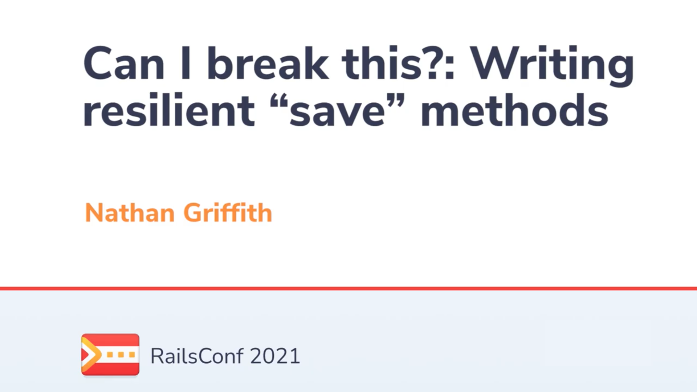
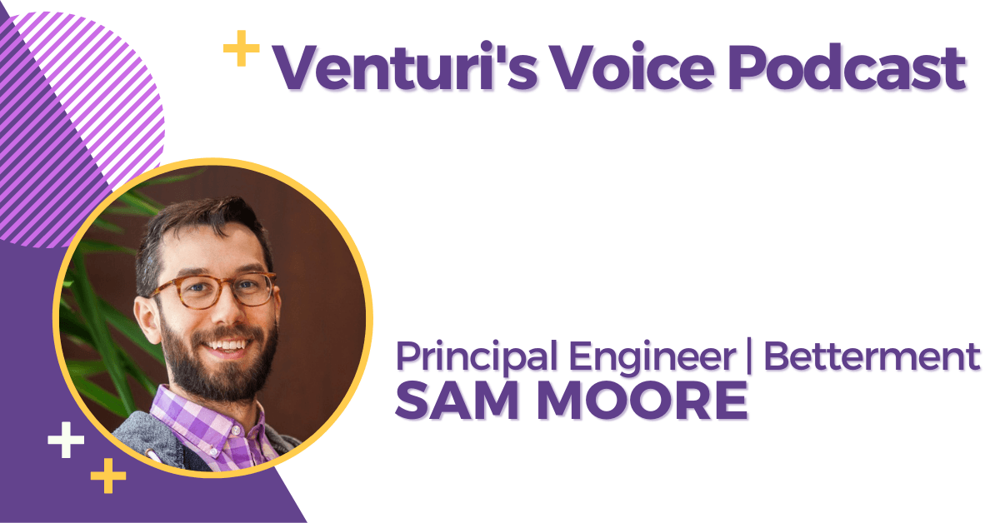
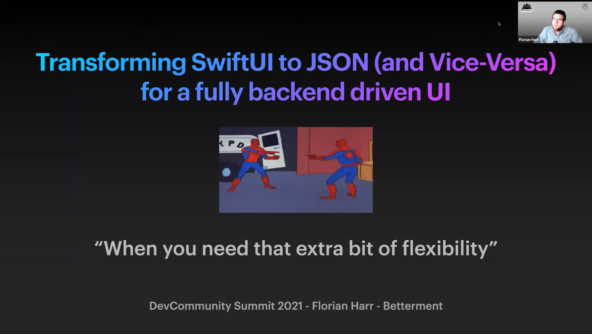

  

# 👋  Hey there! It's us, Betterment Engineering.

We're passionate about building the simplest, most sophisticated investment platform on the planet. We're engineering Betterment to become a top-notch fintech company. High quality code. Beautiful, practical design. A product that people love. Nerd out with us on all things tech. Check out our [engineering blog](https://www.betterment.com/category/engineering/)

## Upcoming talks and events

- [@yieldjessyield](https://github.com/yieldjessyield) and [@caffeineflo](https://github.com/caffeineflo) speaking at [droidcon london](https://www.london.droidcon.com/program/is-flutter-the-coke-zero-of-the-mobile-world%3F)

- [@6f6d6172](https://github.com/6f6d6172) speaking at [rubyconf Denver](https://rubyconf.org/program/sessions#session-1211)

- [@HipsterBrown](https://github.com/HipsterBrown) speaking at [JSConf Mexico](https://jsconf.mx/#speakers)

- Flutter NYC meetup Dec. 2nd: [in person signup](https://www.meetup.com/flutter-nyc/events/281824008/), [virtual signup](https://www.meetup.com/DCFlutter/events/281843939/)

## Hear from our engineers

### Can I break this?: Writing resilient "save" methods - [@smudge](https://github.com/smudge)

### Transitioning to Flutter at Scale - [@samandmoore](https://github.com/samandmoore)

### Transforming SwiftUI to JSON (and Vice-Versa) for a fully backend driven UI - [@caffeineflo](https://github.com/caffeineflo)

## Our open-sourced work

## Tech we use

This organization page is maintained by Betterment Holdings Inc. and it is not associated with Betterment, LLC or MTG, LLC. The content on this page is for informational and educational purposes only. © 2017–2021 Betterment Holdings Inc.